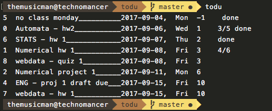

# Todu
a command line to-do list application written in python



## OVERVIEW:
Manage tasks with basic functionality and simplicity. Todu focusses on 
on managing tasks over notes, or lists of items. I wrote this tool because
I wanted an application i could easily track projects and progress. Todu  
allows tells what day a newly added task is due on as well as how many days
remain till the task is due.

The concept behind this app is that every task has a due date and tracking
progress on a porject as it nears its due date is a valuable, albeit simple, 
ability to have.

## FILES:
|file |description |
|-----|------------|
|readme.md| This readme file |
|todu.py |source script to parse data from tasks.dat |
|todu.dat |data file with all of tasks and information |
|pref |preferences for the program |
|todu_help.txt |text to print for the help command |
|todu |alias for todu.py making the program callable as todu |
           
## SETUP

<b> STEP 1: </b>
Clone Repository or download to desired location
```
user@host~$ git clone https://github.com/HarmonicHemispheres/todu.git
```

<b> STEP 2: </b>
Add directory to path. add the following line to your .bashrc or similar
rc file.
```bash
export PATH=$HOME/path/to/todu/dir:/usr/local/bin:$PATH
```

<b> STEP 3: </b>
Restart shell and use todu to be more productive!

## USAGE:

|command |description |status |
|-|-|-|
|todu |displays all tasks and due dates | |
|todu add "task" "date" |adds the task to the todolist | |
|todu etask id "changed task"|changes the task | |
|todu edate id "changed date" |changes the date | |
|todu flag id# X |adds the flag X to the id | |
|todu late |shows all tasks past their due date |** |
|todu pref |shows current preferences | |
|todu set |set any preferences to on or off | |

** indicates the feature is currently in development


## USAGE (view options)

|option |description |status |
|-|-|-|
|-id |shows id#s for tasks | |
|-subs |shows sub tasks | |
|-left |shows time left on tasks | |
|-fl |shows flags for each task | |  
|-day-X |only show X days tasks from now |** |
|-mon-X |only show X months from now tasks |** |
|-flag-X |only show tasks X flag |** |

** indicates the feature is currently in development
